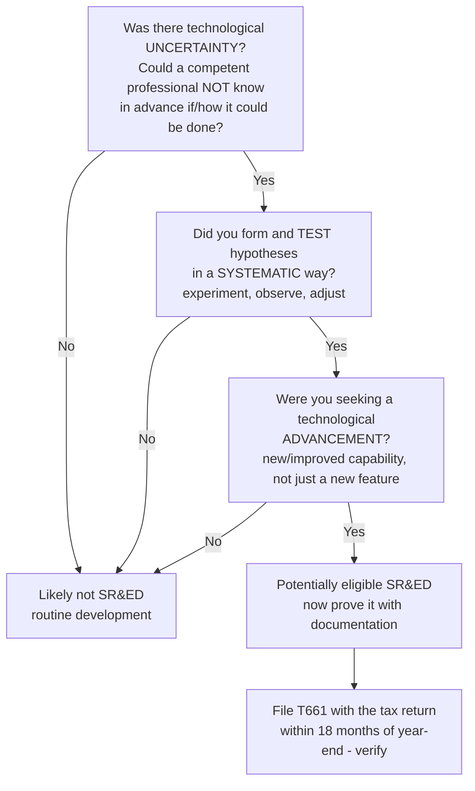
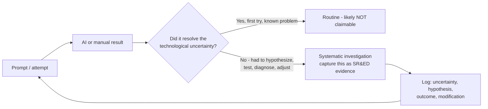
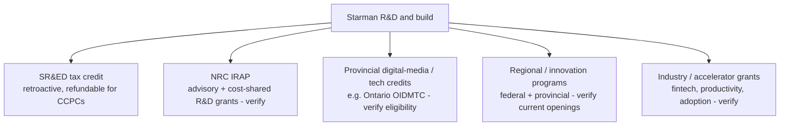
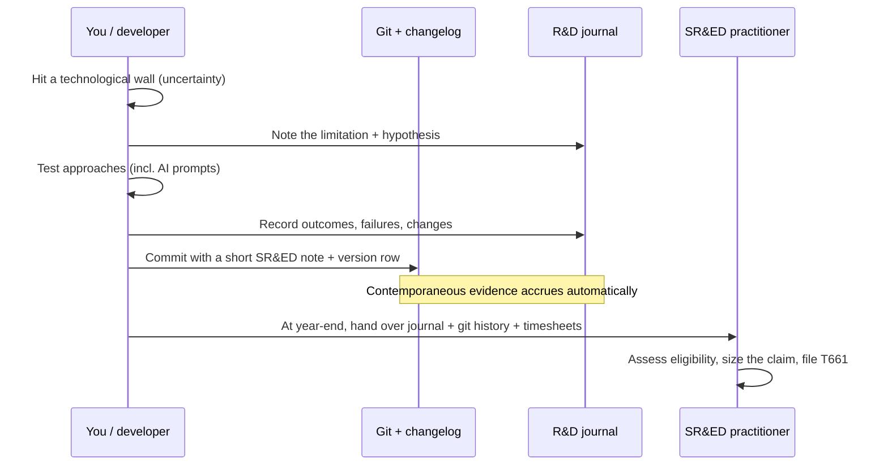

# Starman: SR&ED Tax Credits and Funding Options

**What this is:** an internal guide to how Starman's development — including
AI-assisted ("vibe coding") work — might qualify for Canada's **SR&ED** tax
incentive and other funding, plus how to capture the evidence needed to claim it.

> **Not tax or legal advice.** This is an orientation document, not a filing.
> SR&ED eligibility is fact-specific and the rules, rates, and programs change.
> Confirm everything with a qualified **SR&ED practitioner / CPA** and the CRA
> before relying on any number or claim here. Figures marked *(verify)* are from
> general knowledge and must be checked against current CRA guidance.

---

## 1. TL;DR

- **SR&ED** (Scientific Research and Experimental Development) is the CRA program
  that refunds a portion of eligible R&D spending — salaries, contractors, and some
  overhead — as a tax credit.
- **AI-assisted development does not disqualify you.** What matters is whether you
  were resolving genuine **technological uncertainty** through **systematic
  investigation** — not which tools typed the code.
- **The catch with vibe coding is evidence.** Work that happens in fast
  prompt-and-response loops leaves a thin paper trail. SR&ED is won or lost on
  documentation. Starman is unusually well-placed here because it already keeps a
  **changelog convention**, a **version history**, and an **audit log** — capture
  the R&D story in those same habits.
- **SR&ED is not the only door.** IRAP grants, provincial digital-media credits, and
  other programs may fit. See §7.
- **Next step:** answer the two questions in §9 so a practitioner can assess fit.

---

## 2. What SR&ED pays (ballpark, verify)

SR&ED returns an **investment tax credit (ITC)** on qualified expenditures.

| Claimant type | Enhanced/refundable rate *(verify)* | Notes |
|---|---|---|
| Canadian-controlled private corporation (CCPC) | **35% refundable** on qualified SR&ED up to an annual expenditure limit | The refundable piece is the valuable one — you get cash even with no tax owing. |
| Other corporations | **15%** (largely non-refundable) | Offsets tax payable. |
| Provincial top-ups | Varies by province *(verify)* | Many provinces add their own SR&ED credit on top of the federal one. |

- The federal **expenditure limit** and whether the enhanced rate extends to more
  claimant types have been the subject of recent budget changes *(verify current
  limit and eligibility with a practitioner)*.
- **Aspire is a CCPC** (a private Canadian advisory firm), which is the best-case
  category for the refundable credit — worth confirming its exact structure with the
  accountant.

**Rule of thumb:** the claim is built mostly from the **labour** spent on the
eligible experimental work (your and any developers' time), not from software
licences or hardware.

---

## 3. Does the work qualify? The CRA's three-part test

The CRA reduces eligibility to whether the work sought a **technological
advancement** by resolving **technological uncertainty** through a **systematic
investigation**. All three must be present.

Key distinctions the CRA looks for:
- **Uncertainty is technological, not commercial.** "We didn't know if the market
  wanted it" is not SR&ED. "We didn't know if the architecture could hit the latency
  / accuracy / correctness target, and standard approaches didn't obviously work" can
  be.
- **Advancement over routine.** Wiring up a known library the documented way is
  routine. Having to devise a non-obvious approach because the known ways failed is
  the advancement.
- **Systematic, not trial-and-error-by-luck.** You framed a hypothesis, tried it,
  measured, and iterated.

---

## 4. The vibe-coding angle: how AI-assisted work fits

Using an AI assistant to write code is just a tool choice, like using a compiler or
Stack Overflow. It does **not** remove eligibility. But it **shifts where the risk
is** to two places:

1. **Was there real uncertainty**, or did the AI make it routine? If the model
   produced a working answer to a well-known problem on the first try, that stretch
   of work is probably routine development. The eligible parts are where you hit a
   wall the model could not solve directly and you had to **investigate
   systematically** — reframing the problem, testing competing approaches, diagnosing
   why generated solutions failed, and engineering around them.
2. **Evidence.** Prompt-and-response work is fast and ephemeral. If you cannot show
   the systematic process, you cannot claim it, however real it was.

---

## 5. Documentation is Crucial

Under the CRA's [Eligibility Criteria (canada.ca)](https://www.canada.ca/en/revenue-agency/services/scientific-research-experimental-development-tax-incentive-program/sred-eligibility.html),
you must be able to prove your systematic process. Because vibe coding can happen in
fleeting prompt-response windows, you must diligently track:
[[1](https://medium.com/@lsci/how-to-improve-tax-credit-filings-with-llms-385a81e2f001),
[2](https://www.linkedin.com/pulse/vibe-coding-rd-tax-credits-us-qres-explained-sred-manufacturing-llxne),
[3](https://www.youtube.com/shorts/O-AdcZBTGUc)]

- The specific **technological limitations** you faced.
- Your **hypotheses** and how you framed your AI prompts to test them.
- The **outcomes, failures, and modifications** made to your approach during the
  process.
  [[1](https://www.cloudiverse.ca/sred-documentation-lessons-from-vortex-energy-services-2025-tcc-63/)]

**What counts as contemporaneous evidence (keep it as you go, not at year-end):**

| Evidence | Where Starman already produces it |
|---|---|
| Dated record of what changed and why | `docs/Starman-Version-History.md` (changelog convention) |
| Commit history with problem/approach in messages | Git log on `aspire-internal-tools/Starman-CRM` |
| System actions and decisions, timestamped | The app's `AuditLog` / `writeAudit()` pattern |
| Design rationale and rejected approaches | The `docs/` design documents (e.g. this folder) |
| Prompt logs showing hypothesis-and-test | Saved AI session transcripts / a running R&D journal |
| Time spent per work item | A simple timesheet tagged to the uncertainty being explored |

> **Practical tip:** add a short **"SR&ED note"** to commit messages or changelog
> rows when a change involved real technological uncertainty — one or two lines on
> the limitation, the hypothesis, and the outcome. That turns your existing habits
> into an audit-ready trail at almost no extra cost.

---

## 6. Candidate SR&ED areas in Starman (assess, do not assume)

These are **candidates worth reviewing** with a practitioner. Listing a feature here
is **not** a claim that it qualifies — each must pass the §3 test, and much of
Starman is deliberately routine product work that would **not** qualify.

| Area | Why it might involve technological uncertainty |
|---|---|
| Provider-neutral asset categorization / roll-up | Deriving consistent category totals across dashboard and client views from heterogeneous, incomplete holdings data. |
| Change-detection & multi-device sync design | Reconciling records across devices and a periodic external file push without conflicts or data loss (see `Starman-Sync-and-SharePoint-Integration.md`). |
| Household inference / combine logic | Automatically surfacing likely household relationships while respecting consent constraints. |
| AI support retrieval over firm records | Building reliable, grounded retrieval and context assembly from Postgres + knowledge docs without leaking data or hallucinating. |
| Compliance-aware data residency architecture | Engineering PIPEDA/CIRO constraints into the data flow (Canadian-region storage, locked connectors, audit-everywhere). |

**Reality check:** the login screen, standard CRUD, styling, and wiring up
documented libraries are **routine** and generally not claimable. Be conservative;
over-claiming is the fastest way to a painful CRA review.

---

## 7. Other funding options (beyond SR&ED)

- **NRC IRAP** *(verify)* — the National Research Council's Industrial Research
  Assistance Program offers advisory services and cost-shared funding for
  innovative SMEs. Often paired with SR&ED (IRAP for forward funding, SR&ED for
  retroactive credit). Talk to an **Industrial Technology Advisor**.
- **Provincial interactive-digital-media / technology credits** *(verify)* — some
  provinces (for example Ontario's OIDMTC) offer credits for qualifying software
  products; eligibility for a B2B internal CRM is not guaranteed and must be checked.
- **Regional and innovation grants** *(verify)* — federal and provincial programs
  open and close over time; a grants advisor or your accountant can scan current
  openings that fit a Canadian fintech/advisory-tech build.
- **Program availability changes.** Do not assume any specific named program is open
  today — confirm current status before planning around it.

**How they combine:** SR&ED is **retroactive** (claimed after the fiscal year on the
work you did). Grants like IRAP are typically **forward-looking** (funding work you
are about to do). Using both — grants to fund the build, SR&ED to recover eligible
labour after — is a common Canadian playbook *(verify with a practitioner, since
some funding must be netted against SR&ED claims)*.

---

## 8. A capture workflow that fits how Starman is already built

1. **Tag uncertainty when it happens.** The moment a problem is non-obvious, start a
   short journal entry (limitation, hypothesis, plan).
2. **Keep the loop in the record.** Outcomes, dead ends, and the change you made —
   that arc *is* the systematic investigation.
3. **Reuse existing habits.** Commit messages, the version history, and the audit log
   are already your paper trail; add the one-line SR&ED note.
4. **Track time** against each uncertainty, even roughly. Labour drives the claim.
5. **Bring in a practitioner early** so the evidence you capture matches what they
   need to file.

---

## 9. To assess fit, answer these

A practitioner will want specifics. To get started, capture:

- **What technological challenge are you trying to solve** with AI-assisted
  development on Starman? (Name the concrete limitation, not the feature.)
- **How long have you / the developers been experimenting** with this specific
  problem? (Rough dates and effort.)

Fill these in for the top candidate areas from §6, and a SR&ED specialist can tell
you whether the specific use-case aligns with CRA guidelines.

---

## 10. Summary

- SR&ED can refund a meaningful share of Starman's eligible R&D labour, and **AI
  assistance does not disqualify the work** — only the absence of uncertainty or
  evidence does.
- The **binding constraint for vibe coding is documentation**: track the limitation,
  the hypothesis, and the outcome, as you go.
- Starman's existing **changelog, version history, and audit log** are most of the
  evidence trail already — extend them with short SR&ED notes.
- Consider **SR&ED alongside grants** (IRAP, provincial/regional programs), and
  confirm current program status.
- **Engage a SR&ED practitioner / CPA** before filing. Nothing here is a substitute
  for that review.

---

### References
- CRA — SR&ED eligibility criteria:
  https://www.canada.ca/en/revenue-agency/services/scientific-research-experimental-development-tax-incentive-program/sred-eligibility.html
- Improving tax-credit filings with LLMs:
  https://medium.com/@lsci/how-to-improve-tax-credit-filings-with-llms-385a81e2f001
- Vibe coding and R&D tax credits:
  https://www.linkedin.com/pulse/vibe-coding-rd-tax-credits-us-qres-explained-sred-manufacturing-llxne
- SR&ED documentation lessons (Vortex Energy Services, 2025 TCC 63):
  https://www.cloudiverse.ca/sred-documentation-lessons-from-vortex-energy-services-2025-tcc-63/
- Short explainer: https://www.youtube.com/shorts/O-AdcZBTGUc
